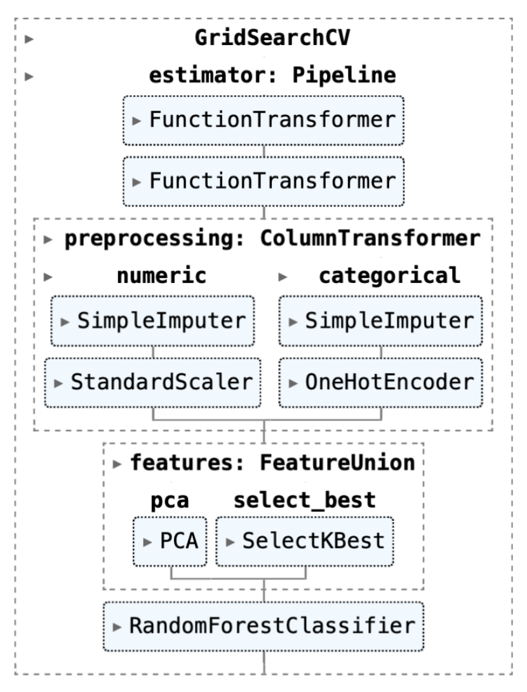
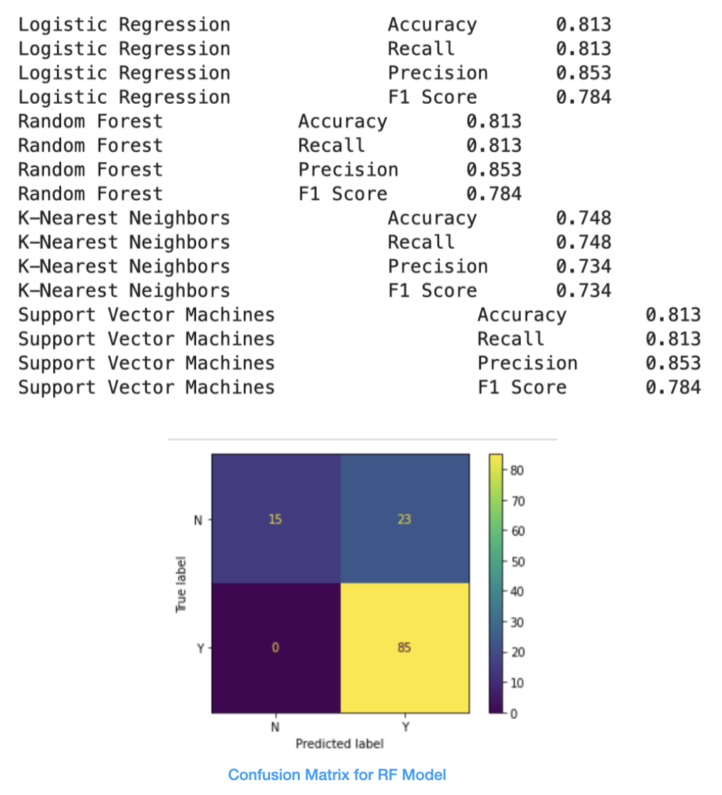
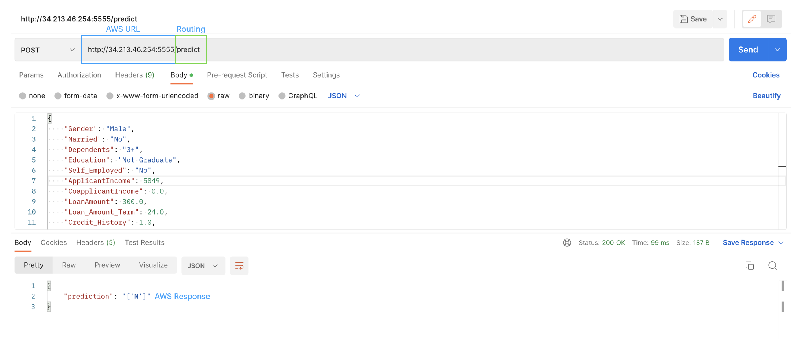

# Mini-project IV

### [Assignment](assignment.md)

## Project/Goals
Goal:  Created a model to predict if applicants will have their loan approved.

---

## _Hypothesis_

1. Applicants having a credit history are more likley to get a loan. 
2. Applicants with a high total income are more likley to get a loan. 
3. Applicants who are Self-Employed are less likely to get a loan.
4. Applicants with a higher education and income are more likely to get a loan.
5. Applicants who are married are more likely to get a loan.

---

## _EDA_
Credit History seems to be a major factor that affects loan status. 

## _Process_
1. Generate Hypothesis
2. Data Exploration and Cleaning 
3. Feature Engineering 
4. Build Pipelines/Models
5. Serialization of models (e.g. Pickle/Joblib)
6. Flask app
7. AWS Deployment
8. Testing

--- 
## _Results/Demo_

### __Visualizing Pipeline__

__Preprocessing:__

Function Transform:
- Create 'Total Income'
- Log 'Loan Amount' and 'Total Income' 

__Column Transform:__
- Numeric (mean)
- Categorical features  (mode) 

__Feature Selection & Union:__
- PCA (n=3) and Select K Best (k=6)

__Model used in deployment:__ Random Forest

__Models used in pipeline:__
- Logistic Regression
- Random Forest
- KNN
- SVM

### __Summary:__
- Models converge in accuracy and precision even if hyper-parameters are varied
- Selected Random Forest as model to deploy

### __Deployment to AWS:__

---

## _Challenges_
- Difficult and time-consuming process to deploy model to AWS
- Figuring out how to get XGBoost to work properly

---

## _Future Goals_
- Try different hyperparameters
- Try using different models and see their performance metrics
- Perhaps trying to create a column for the missing values and then one hot encode to minimize bias
- Try using SMOTE for imbalanced classification 